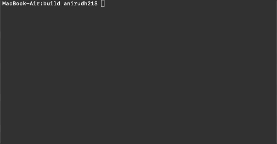

# TrafficCameras
### Objective:

This project is aimed at allowing the traffic police to install minimum number of CC cameras in a given area with many intersections and streets. 

### Description

This is the classical optimization problem called <b>Minimum Vertex Cover</b> problem. In this project, the problem has been solved using three different approaches, using a SAT solver and two approximate algorithms implemented in C++ . A detailed analysis of the using the three different techniques has been reported.

### Getting Started

1. You need to install CMake which will build the executable file. It can be installed from [here](https://cmake.org/install/)

2. I have used the Minisat SAT solver that also provides a nice C++ interface. Instructions on how to use the minisat library can be found [here](https://codingnest.com/modern-sat-solvers-fast-neat-underused-part-1-of-n/) . It is available in this [repository](https://github.com/agurfinkel/minisat) 

### Building and running the executable
 1. Once you clone this repository into you directory of choice, run the following code in the terminal while you are in that directory
 
 ````
 mkdir build && cd build && cmake ../&&make
 ````
 
 This will generate a "make" file inside the "build" folder and the "make" command will build the executable.
 
 2. Then type the following onto the terminal to execute the file
 
 
````
./prj-ece650
````




3. This example shows that there are 5 vertices shown as `V 5` and the undirected graph is `E {<2,1>,<2,0>,<2,3>,<1,4>,<4,3>}`. This represents streets and intersections. The output from the CNF-SAT is the most optimal and can be used to decide the positioning of minimum number of cameras.
